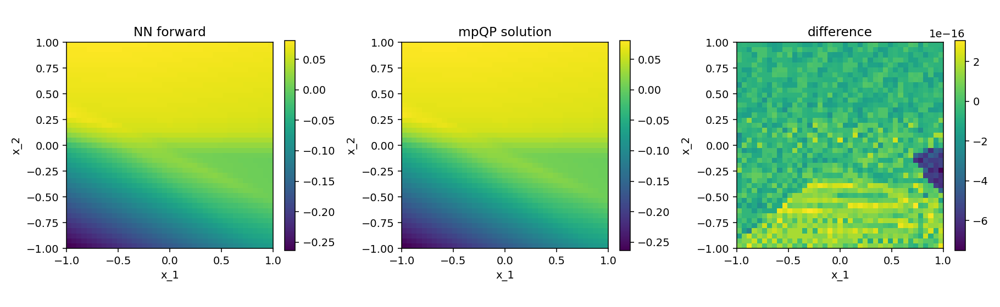

# NN-to-mpQP

Convert a feed-forward ReLU neural network into an equivalent strictly convex
multi-parametric quadratic program (mpQP), and verify the equivalence
numerically.

Given an $L$-layer ReLU network

$$
h_0 = x, \qquad h_l = \mathrm{ReLU}(W_l h_{l-1} + b_l), \quad l = 1, \dots, L,
$$

with bounded input $\lVert x \rVert_\infty \le B_0$, the package builds the mpQP

$$
\begin{aligned}
\min_{z_1,\dots,z_L}\;& \sum_{l=1}^{L} \tfrac{1}{2} \lVert z_l + M_l \mathbf{1} \rVert^2 \\
\text{s.t.}\;& z_l \ge 0, & l &= 1,\dots,L, \\
& z_l \ge W_l z_{l-1} + b_l, & l &= 1,\dots,L, \quad (z_0 := x)
\end{aligned}
$$

with constants $M_l$ chosen by a forward bound-propagation pass and a backward
dual-bound recursion so that the unique optimizer satisfies
$z_l^\star(x) = h_l(x)$ for every hidden layer.

## Installation

```powershell
pip install -r requirements.txt
```

## Quick start

```powershell
python quick_start.py
```

## Example: a 2D ReLU network and its mpQP

`example_2d.py` builds a small ReLU network with input dimension $2$, two
hidden layers of width $6$, and a scalar output (`seed=7`):

```
W1 (6x2) =
 [[ 0.001  0.211]
  [-0.194 -0.630]
  [-0.322 -0.701]
  [ 0.043  0.948]
  [-0.348 -0.439]
  [ 0.346  0.252]]
b1 = [ 0.011 -0.093 -0.003  0.070 -0.134 -0.046]

W2 (6x6) =
 [[-0.776 -0.526 -0.752 -0.096 -0.517  0.111]
  [ 0.064 -0.076 -1.027 -0.220 -0.020  0.046]
  [-0.625 -0.195 -0.399 -0.330  0.433 -0.330]
  [-0.013  0.361 -0.238 -0.046  0.045  0.026]
  [-0.500  0.031  0.555 -0.632  0.351  0.049]
  [-0.262  0.817  0.311 -0.490  0.030  0.235]]
b2 = [-0.019  0.068 -0.007  0.067  0.144 -0.068]

W3 (1x6) =
 [[ 0.083 -0.189  0.052 -0.485 -0.236 -0.080]]
b3 = [0.090]
```

With $B_0 = 1$, the resulting mpQP has

- parameter dimension $n_x = 2$,
- decision dimension $n_z = 12$ (two hidden layers of $6$),
- $n_c = 24$ linear inequality constraints,
- layer constants $M = (7.377,\, 1.000)$.

In standard form

$$
\min_{z}\; \tfrac{1}{2} z^\top Q z + c^\top z
\quad \text{s.t.} \quad A z \le b + S x,
$$

with $Q = I_{12}$, $c = [M_1 \mathbf{1}_6;\, M_2 \mathbf{1}_6]$, and
$(A, b, S)$ encoding the two per-layer blocks $z_l \ge 0$ and
$z_l \ge W_l z_{l-1} + b_l$. The final linear layer $(W_3, b_3)$ is applied
outside the mpQP: $F(x) = W_3\, z_L^\star(x) + b_3$.

Comparing the network's forward pass against the mpQP optimum on a $41\times41$
grid of $[-1, 1]^2$:

$$
\max_{x} \bigl| F_{\mathrm{nn}}(x) - \bigl(W_3 z_L^\star(x) + b_3\bigr) \bigr|
\;=\; 7.49 \times 10^{-16}.
$$



## Random tests

`test_random.py` runs the construction across input dimensions 1-5 with fixed
random seeds:

```powershell
pytest test_random.py -q
# or
python test_random.py
```
